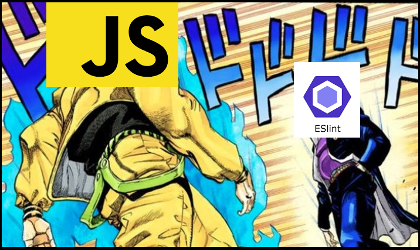

# eslint-config-mudamuda
A [sharable eslint config](https://eslint.org/docs/developer-guide/shareable-configs.html). Use it if you like my style \o/

<div align="center">
	<p>
		<a href="https://www.npmjs.com/package/eslint-config-mudamuda"></a>
		<a href="https://www.npmjs.com/package/eslint-config-mudamuda"></a>
		<a href="https://david-dm.org/iCrawl/eslint-config-mudamuda"></a>
	</p>
	<p>
		<a href="https://nodei.co/npm/eslint-config-mudamuda/"></a>
	</p>
</div>

<p align="center">
  
</p>

Happy coding!
# Installation & Usage
`npm install --dev eslint-config-mudamuda`

Afterwards, add the config to `eslintrc.js` or `eslintrc.json`:
```js
{
	"extends": "mudamuda"
}
```
Extended rule sets are also available to JavaScript frameworks & environments:
```js
{
	"extends": "mudamuda/node"
}
```
